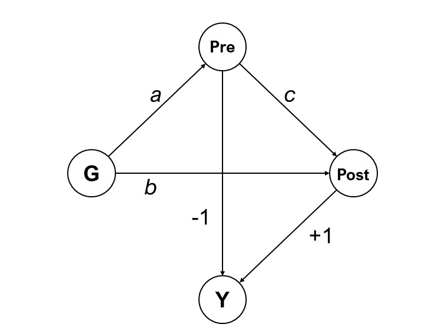

```{r setup, include=FALSE}
knitr::opts_chunk$set(echo = TRUE)
```

```{r packages, include=FALSE}
library(ggplot2)
library(reactable)
library(knitr)
library(kableExtra)
```

## Motivation

Recently I came across a publication [@farmus2019] where the authors outline a statistical artifact that may arise when researchers add continuous predictors correlated with baseline scores as covariates in regression models of pretest-posttest analysis. This effect is known widely as [Lord's Paradox](https://en.wikipedia.org/wiki/Lord%27s_paradox).

First I'll briefly cover what is the regression artifact discussed in the first part of the paper. My main goal, however, is to rerun the simulation from part two of their study. This was motivated by the unavailability of the source code as well as an exercise on building a simple simulation study. Replicating simulation studies is a good practice not only to spot potential errors or biases in the results but also to learn and rehearse open research practices [@lohmann2021].

The code is pretty straightforward and there is nothing too fancy about the methods, but I hope you may learn something from this post that you can apply in your own studies. Having to think about how to translate words and equations into code also made me pause and think with more depth on what I was reading.

I'll be using R for the simulations. For pedagogical reasons I have opted to work with base R, limiting the use of external packages only to facilitate summarizing results and building plots. I'm saying that because there is the great [`faux` package](https://debruine.github.io/faux/) developed by [Lisa DeBruine](https://twitter.com/LisaDeBruine) for simulating factorial designs that could save us many lines of code.

## Lord's Paradox and the Regression Artifact

Say that we want to test a treatment in two preexisting groups, A and B. Given some prior knowledge about the nature of our hypothetical dependent variable, we have strong basis to suppose that a random subject from group B is higher on average on DV scores than a random subject from group A. Because those groups occur naturally it isn't possible to perform random assignment of subjects to groups.

We need to specify how we're going to analyse the data. Given our research design and question there are two potential statistical models to be chosen from [@farmus2019]:

A change score model (*t* test)

```{=tex}
\begin{equation}
post_i = \beta_0 + \beta_1group_i + pre_i + e_i
(\#eq:change)
\end{equation}
```
A regression based model (ANCOVA)

```{=tex}
\begin{equation}
post_i = \beta_0 + \beta_1group_i + \beta_2pre_i + e_i
(\#eq:ancova)
\end{equation}
```

Here $pre_i$ and $post_i$ are the pretest and posttest scores of subject $i$. In equation \@ref(eq:change), $\beta_1$ is the main effect of group (or group mean differences) on gain scores and in equation \@ref(eq:ancova), it is the partial regression coefficient of $group$ adjusted for pretest scores. The model intercept is $\beta_0$ and the model residuals is represented by $e_i$.

It should be noted that using $post_i$ or the change score ($post_i - pre_i$) as the outcome variable yields the same results if $pre_i$ is a covariate in the model [@senn_2021].

Though in practice we could choose any of these two models, we may reach different conclusions depending on which one we use. In fact, the choice of the model relies on the questions we're asking.

The ANCOVA model is preferred when we do not expect baseline differences between groups. This model estimates the difference in post treatment scores controlling for baseline variations [@walker]. Using pretest scores as covariate when groups are known to be different at baseline is a poor choice because we do not expect the initial differences to disappear when scores are averaged over the group [@pearl2016]. As we'll see shortly, this is exactly why the paradox emerges.

The change score model do not assume that groups are similar at baseline. It tests if groups differ on average on how much they change on the outcome variable from pretest to posttest. The effect of treatment is the difference of pre to post differences between the two groups [@walker].

What Lord [-@lord1967] observed is that given a treatment that produces **no effect** on the outcome, a researcher using the ANCOVA model would conclude that, assuming equal baseline scores, one subgroup appears to gain significantly more than the other. A second researcher analyzing the same dataset with the change score model would not reject the null hypothesis that $\beta_1$ = 0.

Though we have used a categorical predictor $group_i$, the emergence of the paradox is extended to continuous variables. To give rise to the artifact, there needs only to exists some correlation between this predictor and the pretest scores as well as random error in the assessment of change [@eriksson2014]. It can happen if, for example, participants are allocated into groups based on scores on some continuous predictor that happens to be associated with the parameter under investigation [@wright2006].

In most research settings (e.g. psychology), measurement is made with some degree of error. In the persence of random error of measurement, this variance is incorporated in the pre and posttest scores. If we let $U_i$ represent the "true score" (i.e. what we would get if there were no measurement error) of subject $i$, we have:

```{=tex}
\begin{equation}
pre_i = U_i^{pre} + e_i^{pre}
(\#eq:pre)
\end{equation}
```
```{=tex}
\begin{equation}
post_i = U_i^{post} + e_i^{post}
(\#eq:post)
\end{equation}
```
Then, because the expected effect size of treatment is zero, $U_i^{post} - U_i^{pre}$ reflects only the difference between random errors [@eriksson2014].

To keep consistent with the terminology used in @eriksson2014, we use $P_i$ to denote the group variable for the $i^{th}$ subject, where $P_i = 0$ for Group A and $P_i = 1$ for Group B (keep in mind that there is no restriction on $P$ begin solely categorical). Because the "true" pretest scores is estimated from the grouping variable, we have:

```{=tex}
\begin{equation}
U_i = a + bP_i + \epsilon_i
(\#eq:true)
\end{equation}
```
where $a$ is the model intercept, $b$ the regression coefficient of $P_i$ on $U_i$ and $\epsilon_i$ is the between-individual variation in $U$.

Lets assume the error term in the measurement of pretest and posttest scores is drawn from a normal distribution with mean 0 and standard deviation, $\sigma$. Likewise, the error term for the regression of property $P$ on true score $U_i$ is drawn from a normal distribution with mean 0 and standard deviation $s$.

For a sample of 200 subjects we set, $a$ = 0.5, $b$ = 0.4, $s$ = 0.1, $\sigma$ = 0.1.

```{r simulation-1, show_code = TRUE, code_folding = FALSE}
set.seed(7895) # set seed for reproducibility

a <- 0.5 # model intercept
b <- 0.4 # regression coefficient
sigma_error <- .1 # pre and posttest error term standard deviation
var_error <-  .1  # P error term standard deviation
n <- 200 # sample size

group <- rep(c(1,0), each=n/2) # group predictor
U <- cbind(1, group) %*% c(a, b) + rnorm(n, 0, var_error) # true score
post <- U + rnorm(n, 0, sigma_error) # posttest scores
pre <- U + rnorm(n, 0, sigma_error)  # pretest scorers
change <- post-pre                   # change scores

sim.df <- data.frame("post" =  post, 
                     "pre" =  pre, 
                     "change" = change, 
                     "group"= factor(group))
```


(ref:sim-plot-1) Scatterplot for the average gain from pre to post treatment. Blue line is the slope for group A and the red line is the slope for group B. The black dashed line is the slope for average gain taking both groups together

```{r sim-plot-1, fig.cap='(ref:sim-plot-1)', message=FALSE, warning=FALSE, fig.align='center'}

pre_post <- ggplot(sim.df) +
  geom_point(aes(x= pre, y = post, color=group),size = 2.5) +
  geom_smooth(aes(x= pre, y = post, color=group),method='lm', 
              se = FALSE, formula= y~x, fullrange=TRUE) +
  stat_ellipse(aes(x= pre, y = post, color=group),size = 1) +
  labs(x = "Pretest scores",
       y = "Posttest scores") +
  scale_color_manual(name = "Group", labels = c("A", "B"), 
                     values = c("#1E88E5", "#D81B60")) +
  theme_minimal(12) +
  geom_smooth(aes(x= pre, y = post), method='lm', se = FALSE, color = "#000000",
              linetype = "dashed", formula= y~x, fullrange=TRUE) +
  xlim(0, NA) + 
  ylim(0, NA)

pre_change <- ggplot(sim.df) +
  geom_point(aes(x= pre, y = change, color=group),size = 2.5) +
  geom_smooth(aes(x= pre, y = change, color=group),method='lm', se = FALSE, formula= y~x, fullrange=TRUE) +
  geom_smooth(aes(x= pre, y = change),method='lm', se = FALSE, formula= y~x, fullrange=TRUE) +
  theme_minimal(12)

pre_post
```

So, what do we see? The black dashed line crossing both elipses is close to 45° which means that, taking both groups as a whole, looks like there is no evidence of average differences between groups. In this particular example the slopes for both groups behave as we should often expect when there is no change in scores between two time points. It is visually clear that both are very similar.

Notice that when subjects from groups A and B fall on the same range of pretest scores we see more red dots on the upper half of the plot, suggesting higher posttest scores from subjects in group B. As noted by @eriksson2014 what is happening is simply an effect of regression to the mean. Because when subjects from group B (higher true score) score low on pretest, they are more likely to do better at posttest. A similar logic applies to high scorers from group A scoring poorer on the followup.

### A mediational perspective

It can also help to visualize the difference between the two models using diagrams. As shown by @pearl2016, we can represent Lord's paradox as a mediation model,

```{r, echo=FALSE, code_folding = FALSE, show_code = FALSE, out.width="50%", fig.align='center',fig.cap="Linear version of the model showing pretest scores (Pre) as a mediator between Group (G) and posttest scores (Post). Adapted from @pearl2016"}

```

where **G** is the group variable, **Pre** the pretest scores, **Post** the posttest scores and **Y** stands for the difference Post - Pre. What differentiates the ANCOVA and the change score perspectives lies on which effect we wish to estimate. Assuming no confounding, the *total effect* is estimated as

```{=tex}
\begin{equation}
TE = (b + ac) - a
(\#eq:te)
\end{equation}
```
Setting $b = a(1-c)$ all paths cancel out each other and we obtain the total effect of 0 observed in our made up experiment.

If we opt for adjusting for pretest scores, the path $ac$ is blocked and only the *direct effect* is estimated, which is,

```{=tex}
\begin{equation}
DE = b
(\#eq:de)
\end{equation}
```
Because the direct effect is positive, it becomes clear why the effect for the ANCOVA model is non-zero.

### The regression artifact

The issue raised in @farmus2019 is that Lord's Paradox isn't restricted to categorical predictors. A similar effect can emerge if a continuous predictor of change is correlated with pretest scores and an ANCOVA model is used. Through a literature review, the authors confirm that studies meeting these conditions are not uncommon among papers published in top psychology journals.

For simplicity I'll not bother to show the mathematical derivation of the regression artifact here but the interested reader can refer to @eriksson2014 or @kim2018. What we need to have in mind is that the regression artifact is the coefficient $\beta_1$ from equation \@ref(eq:ancova). Using @eriksson2014 notation, the estimate for the regression artifact is expressed as:

```{=tex}
\begin{equation}
\hat{K} = \frac{b\sigma^2}{(s^2+\sigma^2)}
(\#eq:regart)
\end{equation}
```
If we input the parameters set to build figure \@ref(fig:sim-plot-1) and calculate the value of $K$, assuming infinite samples, $K$ = 0.2.

Surprisingly, re-running @eriksson2014 simulation of the regression artifact, we get a different estimate for its standard deviation.

```{r simulation-2}

set.seed(7895)

K <- c()
reps <- 10000

for (i in seq(reps)) {
a <- 0.5
b <- 0.4
sigma_error <- .1
var_error <-  .1
n <- 105

group <- sample(c(0, 1), n, replace = TRUE)
U <- cbind(1, group) %*% c(a, b) + rnorm(n, 0, var_error)
post <- U + rnorm(n, 0, sigma_error)
pre <- U + rnorm(n, 0, sigma_error)
change <- post-pre

sim.df <- data.frame("post" =  post, 
                     "pre" =  pre, 
                     "change" = change, 
                     "group"= factor(group))
  s <- summary(lm(change ~ pre + group, data = sim.df))
  K[i] <- s$coefficients[3,1]
}

k_mean <- mean(K)
k_sd <- sd(K)
```

```{r hist-K, fig.cap="Distribution of the coefficients for predictor $P$ on the change score", message=FALSE, warning=FALSE}
tibble::enframe(K) |> 
  ggplot(aes(x = value)) + 
  geom_histogram(color = "black", fill = "lightblue1") +
  labs(x = latex2exp::TeX("Coefficient for $\\hat{K}$"),
       y = "Frequency") +
  theme_minimal(12)
```

As expected, the mean value for $\hat{K}$ is `r round(k_mean, 2)`. Our estimate for the standard deviation of $\hat{K}$ is `r round(k_sd, 2)`, close to half the value @eriksson2014 reported. In their study, they have found 98% of $\hat{K}$ values greater than zero. In 10,000 simulated datasets, we found the frequency of $\hat{K}$ \> 0 to be `r sum(K > 0)/reps*100`%[^1].

[^1]: I'm not excluding the possibility that it may have been me that got it wrong. If this is the case and you identify where I screwed up, please let me know!

## Re-running Farmus et. al (2019)

We now return to @farmus2019 study. Including the baseline scores as covariate in a pretest to posttest change model may lead us to falsely conclude a significant association if a non-negligible correlation exists between the predictor and the covariate. The authors use Monte Carlo simulations to estimate Type I error rate in scenarios like the one described, varying the size of $b$ (equation \@ref(eq:true)), and the sample size.

Other parameters were fixed such that the standard deviation of $e_i^{pre}$, $e_i^{post}$, and $\epsilon_i$ were set to 1. The variance of $P$ ($\sigma^2_P$) was also set to 1. Both $\beta_0$ and $a$ were set to 0. Coefficient $b$ ranged from -1 to 1 by 0.5 steps and sample sizes of 20, 50, 100, and 1,000 were used. To keep every condition exact as the original study, 5,000 simulations were run for each pair and the statistical significance level set at 0.05.

The simulation will only estimate the Type I error rates because the size of parameters like the regression artifact ($K$) and the correlation between the pretest scores and true score ($\rho(pre,P)$) can be estimated from the parameters values fixed previously.

Looking at equations \@ref(eq:pre) and \@ref(eq:true) we know that,

```{=tex}
\begin{equation}
pre_i = a + bP_i + \epsilon_i + e_i^{pre}
(\#eq:pre2)
\end{equation}
```
then calculating $\rho_{(pre,P)}$ becomes straightforward

```{=tex}
\begin{align}
\begin{split}
  \rho_{pre,P} & = \frac{\mathrm{Cov}(pre, P)}{\sigma_{pre}\sigma_{P}}\\
  & = \frac{b\sigma^2_P}{(\sqrt{b^2\sigma^2_P + s^2 + \sigma^2}) + \sigma^2_P}
\end{split}
  (\#eq:rho)
\end{align}
```
Our first step is to create a function that takes as arguments the number of runs, sample size and the population value of coefficient $b$. We can store the *p*-value of each analysis and count afterwards how many were less than the the alpha level.

```{r fun-sim, show_code = TRUE, code_folding = FALSE}
sim.reg.artifact <- function(n.sims, sample.size, beta) {

  reps <- n.sims
  n <- sample.size
  beta <- beta
  b0 <- 0
  X.sd <- sigma_error <- var_error <-  1
  pval <- NULL
  r <- (beta*(X.sd)^2)/(sqrt((beta^2)*((X.sd)^2) + (sigma_error^2) + (var_error^2)))
  K <- (beta*sigma_error)/(sigma_error + var_error) # the regression artifact

  for (i in seq(1, reps)) {

    P = rnorm(n = n, mean = 0, sd = 1) # Property P from equation 5
    U <- b0 + beta*P + rnorm(n, 0, var_error) # The "true score" from equation 5

    pre <- U + rnorm(n, 0, sigma_error) # Pretest scores - equation 3
    post <-  U + rnorm(n, 0, sigma_error) # Posttest scores - equation 4

    Xy <- as.data.frame(cbind(P, pre, post)) # A dataframe with outcome and predictors
    colnames(Xy) <- c("P", "pre", "post")
    
    fit <- lm(post ~ ., data = Xy)
    s <- summary(fit)
    pval[i] <- ifelse(s$coefficients[2,4] < 0.05, 1, 0) # p-value for the coefficient of P

  }
  
  # store the simulated results in a data frame for display
  res <- data.frame(
    sample_size = n,
    bx = beta,
    correlation = r,
    artifact = K,
    error_rate = mean(pval)
  )

  return(res)
}
```

Nesting for loops can easily become confusing, so I have opted to use the `purrr::map_dfr()` function, which I find to be a simpler and more elegant solution.

```{r simulation-3, show_code = TRUE, code_folding = FALSE}

samplesize <- list(20, 50, 100, 1000)
coefs <- as.list(seq(-1,1, by = 0.5))


finaltable <- purrr::map_dfr(samplesize,
                             ~purrr::map2(.x, coefs,
                                          ~sim.reg.artifact(5000, .x, .y)))
```

```{r results-table}
finaltable |> 
  tidyr::pivot_wider(names_from = sample_size, values_from = error_rate) |>
  kbl(
    col.names = c("$b_x$", "$\\rho(pre,P)$", "Artifact", "N = 20",
                  "N = 50", "N = 100", "N = 1,000"),
    digits = 3,
    align = 'c'
  ) |> 
  kable_styling(bootstrap_options = c("striped", "hover", "condensed", "responsive")) |> 
  add_header_above(c(" " = 3, "Type I error rate" = 4 ))
```

Great! Our results match pretty closely those reported by @farmus2019. Notice that in a world where $\rho_{(pre,P)}$ is zero, in the long run the Type I error rate stay within range of what was expected.

To wrap up, we can use the function just created to also reproduce the simulations @farmus2019 ran using median parameter values discovered in their literature review of experimental psychology studies.

```{r simulation-4}
sim2 <- sim.reg.artifact(n.sims = 5000, sample.size = 239, beta = .4)

sim2 |> 
  kbl(
    col.names = c("Sample size", "$b_x$", "$\\rho(pre,P)$", "Artifact", "Type I error rate"),
    digits = 3,
    align = 'c'
  ) |> 
  kable_styling(bootstrap_options = c("striped", "hover", "condensed", "responsive"))
  
```

Again we have a match of results with the original study. What makes those results alarming is the Type I error rate of `r round(dplyr::pull(sim2, error_rate),2)`! As the authors emphasize, common conditions in psychological research may elicit unacceptably high error rates which researchers may not be aware of if an inappropriate model is employed.

## Conclusion

We have covered a definition of Lord's Paradox and argued that choosing a model that does not fit the research question can lead to biased conclusions. As @farmus2019 outline, correlation between the predictor and the outcome and some amount of measurement error are necessary conditions for the emergence of a regression artifact. It is important that researchers take this into consideration before drawing conclusions about the data.

Following recent calls to reproduce simulation studies [@lohmann2021] we have worked to reproduce simulations performed by two papers discussing Lord's Paradox with continuous predictors. Monte Carlo simulations are not needed to demonstrate the regression artifact and no major recommendations are being proposed by the original studies based on the simulation results. Even so, a minor discrepancy from @eriksson2014 was found, highlighting that computer code is not error free. Reproducing simulation analysis proved to be fruitful not only in finding divergent results but also as a coding exercise.

Lord's Paradox have been and continues to be widely debated in the quantitative methods literature. Many of the papers referenced in the text broaden the discussion investigating this topic in different and more complex scenarios. Hopefully this post has reached its instructive purpose of teaching a few things about simulating data in R. If you have any comments or questions, feel free to reach me via email or twitter.
